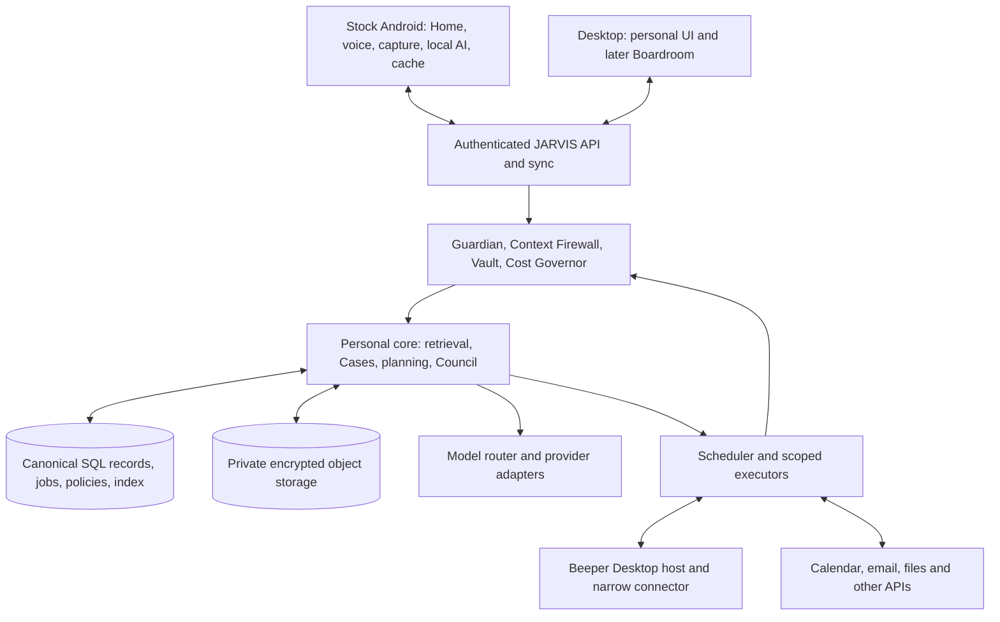

# JARVIS architecture

Responsibility: component ownership, communication, deployment and failure contracts. Product outcomes belong to [PRD.md](PRD.md); permissions to [SECURITY_PRIVACY_AND_PERMISSIONS.md](SECURITY_PRIVACY_AND_PERMISSIONS.md).

Status: stock Android, one personal core, hybrid intelligence, scoped agents and a permanent personal index are **architecture decisions supported by user requirements**. The detailed contracts below are **architecture synthesis** for implementing them. They are not claims that every service already exists. See [IMPLEMENTATION_STATUS.md](IMPLEMENTATION_STATUS.md) for reported code and deployment state.

## Logical topology

The diagram shows logical responsibilities, not a requirement for a separate paid service per box. Every model/tool path uses the authority services even where arrows are abbreviated. No agent receives a general database or credential connection.

## Ownership and durable state

| Component            | Owns                                                                                                  | Does not own                                                                          |
| -------------------- | ----------------------------------------------------------------------------------------------------- | ------------------------------------------------------------------------------------- |
| Android shell        | HOME navigation, app launching, device capability state, local voice session and collection controls  | OEM lock screen, secure unlock, camera pipeline, banking integrity or Android updates |
| Phone store          | Encrypted recent records, local exact index, pending observations/commands, cached low-risk grants    | A divergent permanent user profile or final remote delivery state                     |
| API and sync         | Authentication, device registration, validated commands, event ingestion, cursor-based changes        | Long-lived model loops tied to an HTTP request                                        |
| Personal core        | User profile, preferences, goals, knowledge, Cases, decisions and cross-surface conversation IDs      | Every external provider's original mailbox/calendar/account state                     |
| SQL store            | Canonical JARVIS records, provenance, entity links, revisions, jobs, grants, action and cost ledgers  | Bulk media blobs or unbounded model scratch text                                      |
| Object store         | Originals selected for retention, exports, attachments, screenshots and derived assets with manifests | Public URLs or authorization policy                                                   |
| Retrieval            | Authorized exact/semantic/entity/time queries and bounded evidence packets                            | Deciding who is allowed to see information                                            |
| Scheduler/executors  | Due work, leases, bounded tool runs, retries and reconciliation                                       | Unlimited autonomy, direct secrets in model prompts or independent task truth         |
| Integration adapters | Provider IDs, capability maps, cursors, rate limits and delivery reconciliation                       | A replacement for JARVIS memory or authorization                                      |
| Council orchestrator | Agent sessions, meeting records, turn budgets and proposed decisions                                  | Extra privileges or a second user identity                                            |

JARVIS owns its durable interpretation and archive. External systems remain authoritative for facts such as whether they accepted a message or the current revision of a calendar event. Store both the last observed provider state and the JARVIS intention; never overwrite one with the other. Native future food, training, running and calendar apps should write typed events directly to the same core, with optional health-platform synchronization rather than a mandatory Apple Health intermediary. [R002, R013, R028]

## Data path

1. A connector or permitted phone collector creates an observation with source ID, source event ID, observed and ingested time, device, permission scope, sensitivity, completeness and schema version.
2. Local rules remove excluded content and redundant noise. Offline observations enter an encrypted outbox with bounded storage.
3. The API validates ownership and idempotency, persists the observation or durable object reference, and creates any required work transactionally.
4. Normalization links entities conservatively. Fusion may create a meaningful event, explicit fact or hypothesis with evidence and confidence. Derived records inherit information restrictions.
5. Retrieval assembles a scoped packet for a user question, Case or agent. Exact lookup and filters precede semantic search and model reasoning.
6. A decision proposal becomes a typed action intent. Guardian, Firewall and Cost Governor check it before execution and again at consequential boundaries.
7. The executor records attempted, accepted, confirmed, failed or unknown outcome. Provider reconciliation supplies evidence. Follow-up modifies the Case, not just the current chat.

The personal index and raw-signal retention contracts are defined in [CONTEXT_AND_MEMORY.md](CONTEXT_AND_MEMORY.md) and [PASSIVE_CONTEXT_ENGINE.md](PASSIVE_CONTEXT_ENGINE.md).

## Interfaces and synchronization

The following are logical API operations, not frozen route names: ingest observations; query personal evidence; submit a command; inspect or correct memory; manage Cases; request/approve/revoke a scoped action; receive device changes; acknowledge local delivery; retrieve action/cost status. Use versioned schemas and explicit errors. Authenticate devices separately from the human owner and use narrow connector identities.

Use stable client event IDs, canonical revisions and server cursors. Keep source time, ingestion time and timezone separately. Idempotency handles repeats; ordering cannot rely on arrival time. Persist deletion tombstones so offline devices do not resurrect removed data. Permission revocation invalidates cached context and pending actions on reconnection.

User edits to preferences or facts require revision checks. Source message edits update source versions and derived summaries. Conflicting person merges or contradictory facts remain reviewable. A local optimistic state must say pending until acknowledged. External writes need source revision/precondition checks where available; otherwise reread and detect conflicts before acting.

Do not treat message polling, notification capture and provider sync as independent new messages. Correlate provider IDs where possible; otherwise retain uncertain duplicate links rather than discarding potentially distinct messages.

## Durable execution

Preserve the existing engineering invariants even if hosting changes. Canonical job records live with application state. Schedule notifications contain opaque IDs and timing, not private payloads. An atomic lease verifies generation, current state, attempt, due time, optional latest-start deadline and lease availability. The worker uses the canonical leased payload. Completion is fenced to the live lease, generation, worker and attempt.

Retrying the same work preserves its generation. Replacing or rescheduling work invalidates stale scheduled callbacks through a new generation. A canceled job cannot start later through an old callback. Cancellation cannot undo an external action that already began; its outcome must be reconciled. Ordinary durable jobs have no accidental blanket expiration. A reminder's explicit freshness deadline can expire while the underlying commitment remains unresolved. These requirements follow S1-M0243–M0253, not an assumption that a green unit suite proved the cloud path.

Exactly-once external effects are not promised. Use provider idempotency when available and a durable outbox otherwise. Unknown message/payment outcomes must be reconciled before a retry. Missing callback delivery is recovered from canonical pending work. One deployment has one authoritative scheduler strategy; migration requires draining or fencing the old one.

## What runs where

| Work                                               | Phone                                  | Backend / connector host                                                                     |
| -------------------------------------------------- | -------------------------------------- | -------------------------------------------------------------------------------------------- |
| Open an app, recent exact search, capture controls | Deterministic local path               | Optional synchronization                                                                     |
| Wake word, selected ASR/TTS and small-model tasks  | Local if installed and benchmarked     | Conversational cloud fallback only with permission, connectivity and budget                  |
| Long-term personal search                          | Recent subset cached                   | Canonical index, broader retrieval and retained objects                                      |
| Raw passive filtering                              | Prefer local                           | Only permitted meaningful events or selected evidence                                        |
| Cases, multi-day jobs, Council                     | Inspect/issue commands                 | Durable state, orchestration and bounded workers                                             |
| Beeper API                                         | Own messaging UI talks to JARVIS       | Running Beeper Desktop plus authenticated connector; phone-only/headless hosting not assumed |
| Browser/computer action                            | Android bounded UI action if supported | Isolated cloud browser or registered physical desktop for tasks that need it                 |
| Boardroom rendering                                | Optional companion controls            | Desktop renders locally; backend retains the same Council state                              |

A cloud executor and the user's physical computer are distinct destinations with different availability, files and permissions. A process/container on the data host is not automatically a sufficient boundary for untrusted browser work. Use separate execution identities, restricted networking and filesystem mounts, and stronger isolation where the threat model requires it. The executor cannot read the entire personal database merely because it shares a VM. [R061–R065]

## Deployment decision, deliberately separated from logical design

**Reported baseline:** Neon canonical SQL; Vercel stateless API; Convex scheduling references only; a Windows outbound bridge was built for the legacy Evolution transport. Convex was paused in the newest report. This baseline is not a requirement to maintain three vendors indefinitely.

**Favored target under evaluation:** an always-on VM running the API, bounded workers and possibly PostgreSQL/pgvector, plus private object storage. This may reduce distributed coordination and support persistent processes. It adds patching, backup, availability and recovery duties. A VM must not be assumed capable of hosting Beeper unattended until its Desktop session, network connections and restart behavior are proven.

Keep the present baseline while evaluating a migration; do not build both as competing sources of truth. Select a deployment after testing Beeper hosting and comparing real cost/operations, then record a new decision and migration plan. See Q04 and T01 in [OPEN_QUESTIONS.md](OPEN_QUESTIONS.md). No separate vector database, graph database, GPU server or paid message bus is selected by this reconstruction.

## Offline and degraded operation

| Failure                               | Required behavior                                                                                                                                                     |
| ------------------------------------- | --------------------------------------------------------------------------------------------------------------------------------------------------------------------- |
| No internet                           | Home and normal Android apps remain usable; installed local commands/search work; capture and safe intents queue; cloud reasoning and external sends show unavailable |
| Backend unavailable                   | Phone shows last sync time and limited cache scope; local timers continue where configured; queued remote effects revalidate later                                    |
| Beeper host/network unavailable       | Cached chats remain searchable; live status becomes stale; drafts can be saved; autonomous Handoff pauses rather than inventing delivery                              |
| Model unavailable or budget exhausted | Try an allowed adequate lower tier; otherwise save work and report the limitation; no silent paid upgrade                                                             |
| Permission revoked                    | Stop the relevant collection/action immediately when observed; explain affected capability; preserve unrelated functions                                              |
| Low storage/battery/thermal pressure  | Reduce optional sampling and unload models before degrading Home; report collection gaps                                                                              |
| Phone restarts or is force-stopped    | Restore supported scheduled work and sync state on permitted startup; do not claim uninterrupted capture; test actual Android behavior                                |
| Outbox replay after a long gap        | Recheck generation, current context, consent, deadlines and budget; stale Handoff messages do not send automatically                                                  |

The phone may execute only previously authorized low-risk local behavior offline. Cloud-sensitive permissions and revocations cannot be known with certainty offline; consequential external effects wait for revalidation. No fallback can bypass the same data, authority or spending controls.

## Acceptance boundary

Prove an end-to-end flow from observation to indexed evidence to an authorized action and reconciled outcome. Test duplicate events, reordered callbacks, revoke-during-run, stale offline writes, provider timeouts and restoration from backup. Liveness, database readiness, scheduler readiness, model configuration, connector availability and product usefulness are separate indicators. The roadmap does not mark the product complete because infrastructure responds with HTTP 200.
